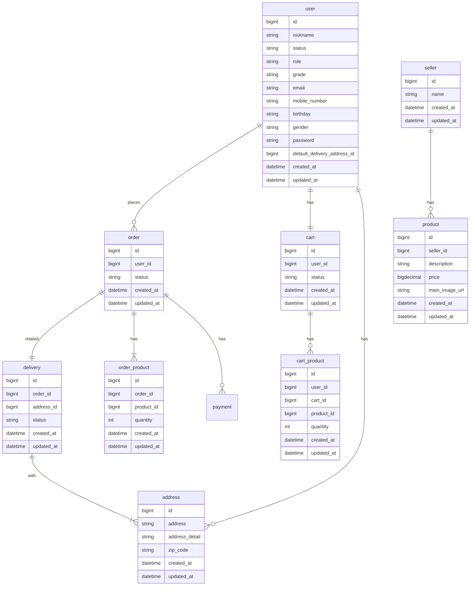

```mermaid
erDiagram
    user ||--o{ order : places
    user ||--|| cart : has
    user ||--o{ address : has
    user {
        bigint id
        string nickname
        string status
        string role
        string grade
        string email
        string mobile_number
        string birthday
        string gender
        string password
        bigint default_delivery_address_id
        datetime created_at
        datetime updated_at
    }
    
    cart ||--o{ cart_product : has 
    cart {
        bigint id
        bigint user_id
        string status
        datetime created_at
        datetime updated_at
    }
   
    cart_product {
        bigint id
        bigint user_id
        bigint cart_id
        bigint product_id
        int quantity
        datetime created_at
        datetime updated_at
    }
    
    order ||--|| delivery : related 
    order ||--|{ order_product: has
    order ||--o{ payment : has
    order {
        bigint id
        bigint user_id
        string status
        datetime created_at
        datetime updated_at
    }
    
    order_product {
        bigint id
        bigint order_id
        bigint product_id
        int quantity
        datetime created_at
        datetime updated_at
    }
    
    delivery ||--|{ address : with
    delivery {
        bigint id
        bigint order_id
        bigint address_id
        string status
        datetime created_at
        datetime updated_at
    }
    
    seller ||--o{ product : has
    seller {
        bigint id
        string name
        datetime created_at
        datetime updated_at
    }
    
    product {
        bigint id
        bigint seller_id
        string description
        bigdecimal price
        string main_image_url
        datetime created_at
        datetime updated_at
    }
    
    address {
        bigint id
        string address
        string address_detail
        string zip_code
        datetime created_at
        datetime updated_at
    }
```
